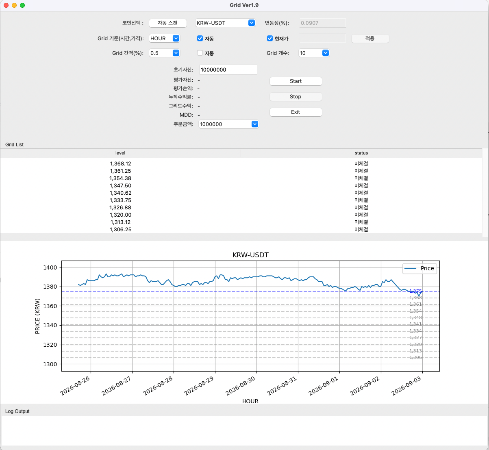

# Grid Trading System

A Python-based automated grid trading system designed for real-time cryptocurrency market monitoring, exchange API integration, automated order execution, and trading state management.

This project demonstrates the design and implementation of a practical event-driven trading automation system with a desktop monitoring interface.

> **Portfolio Showcase**
>
> This repository presents the architecture, features, and interface of the system.  
> Core trading algorithms, proprietary strategy logic, production configuration, and private source code are not publicly available.

---

## Overview

The system was developed to automate the complete workflow of a grid-based trading strategy.

It continuously receives market data, manages dynamic grid levels, tracks trading states, executes orders through exchange APIs, and provides real-time monitoring through a desktop GUI.

The project focuses on reliable automation, API integration, state management, and real-time data processing.

---

## Key Features

- Real-time cryptocurrency market data processing
- Cryptocurrency exchange API integration
- Automated buy and sell order execution
- Dynamic grid level management
- Trading position and order state tracking
- Automated reference-price adjustment
- Real-time asset and performance monitoring
- Desktop GUI for system monitoring and control
- Error handling and operational safeguards
- Automated strategy execution without continuous manual intervention

---

## System Architecture

```text
Cryptocurrency Exchange
        │
        ▼
   Exchange API
        │
        ▼
 Market Data Layer
        │
        ▼
 Trading Engine
        │
        ├── Grid Management
        ├── Strategy Logic
        ├── State Management
        └── Risk / Order Controls
        │
        ▼
   Order Manager
        │
        ▼
 Cryptocurrency Exchange

        │
        ▼
 Monitoring & GUI
```

The architecture separates market data processing, trading logic, order execution, state management, and user monitoring so that each component can be managed independently.

---

## Technology Stack

- **Python**
- **REST API Integration**
- **Real-Time Data Processing**
- **Trading Automation**
- **Tkinter Desktop GUI**
- **Data Processing**
- **Event-Driven System Design**

---

## Desktop Monitoring Interface

The desktop application provides real-time visibility into the automated trading process.

The interface includes:

- Live market price visualization
- Grid level monitoring
- Buy/sell execution status
- Current positions
- Asset valuation
- Profit and loss information
- Strategy status
- Start / Stop controls
- Real-time operational logs

### Application Screenshot

<!-- Add the application screenshot here -->



---

## Automation Workflow

```text
Receive Market Data
        ↓
Update Market State
        ↓
Evaluate Grid Conditions
        ↓
Determine Required Action
        ↓
Create / Manage Orders
        ↓
Update Trading State
        ↓
Refresh Monitoring Interface
        ↓
Repeat
```

The system continuously performs this workflow while the trading engine is active.

---

## Engineering Focus

This project required solving several practical automation challenges:

### Real-Time State Management

The application must maintain synchronization between market prices, grid levels, submitted orders, completed trades, and the user interface.

### API Integration

Exchange APIs are used to retrieve market information and manage trading operations programmatically.

### Dynamic Grid Management

The trading grid can respond to market movement rather than operating only from a permanently fixed price structure.

### Automated Order Management

The system manages order states and trading actions automatically based on predefined strategy rules.

### Monitoring

Operational information is presented through a desktop interface so that the system can be monitored while running autonomously.

---

## Repository Scope

This repository is intended as a **technical portfolio showcase**.

For security and intellectual-property protection, the following components are intentionally excluded:

- Proprietary trading algorithms
- Strategy formulas and parameters
- Production trading logic
- Exchange credentials and API keys
- Private configuration files
- Account information
- Production deployment settings

Selected non-sensitive examples and additional technical documentation may be added separately.

---

## What This Project Demonstrates

This project demonstrates practical experience in:

- Python application development
- API integration
- Workflow automation
- Real-time data processing
- Event-driven application design
- State management
- Desktop application development
- Automated system monitoring
- Building production-oriented financial software

---

## Security

No API keys, exchange credentials, account information, or other sensitive production data are included in this repository.

Secrets and production configuration are maintained separately from publicly accessible project resources.

---

## Status

**Active / Portfolio Showcase**

The underlying system has been developed as a functional trading automation application. This public repository focuses on demonstrating its architecture, interface, and engineering approach while protecting proprietary strategy components.
